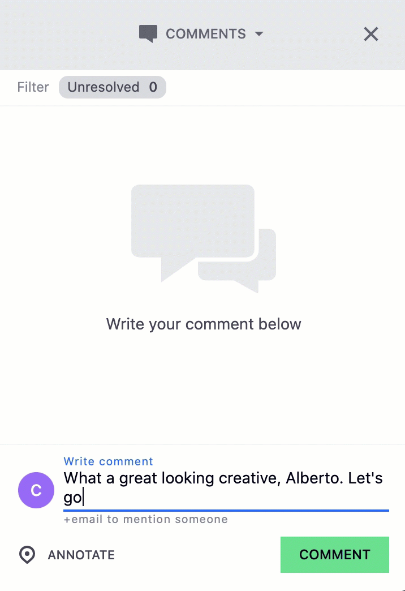
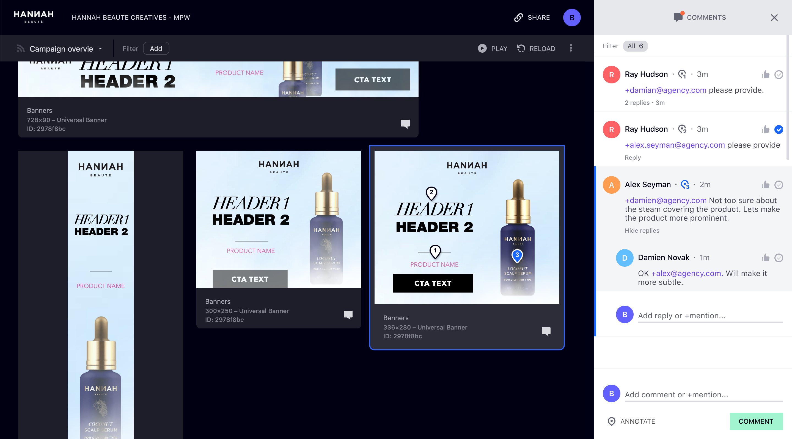
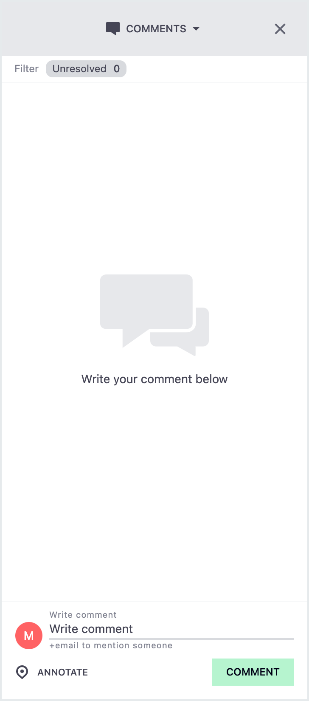
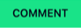
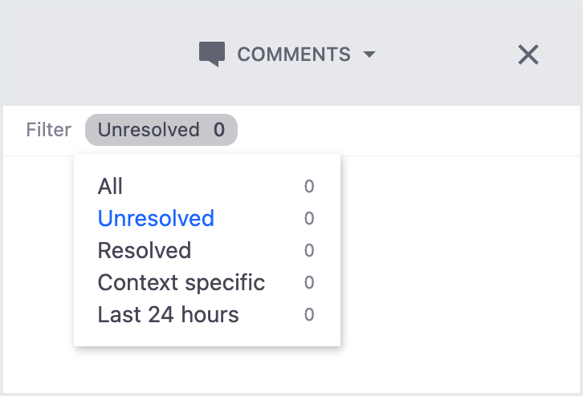
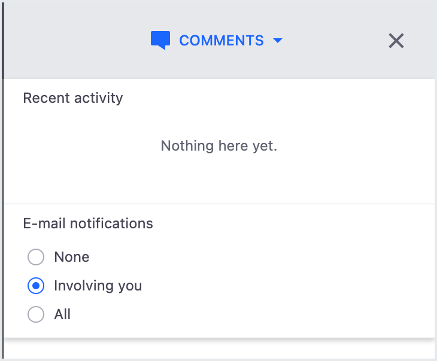

# Comments

Comments is a feature in Celtra that allows you to utilize team collaboration at every stage of the production process. Comments gives you access to creative feedback, edits, and approvals all in one place. You also have the ability to mention other team members in comments, as well as invite individuals that are not part of the platform to collaborate. 

Refer to the following sections for step-by-step instructions for using each Comments feature.

## Writing a New Comment
1. Click on **Comments** in the top right hand corner of either the Builder or Preview. The Comments menu opens. 

2. To add a new comment, click in the field and begin typing. Comments must be less than 1000 single-byte characters.

3. When you're finished, click on the **Comment button** to add your comment. 

## Mentioning a User
When you write a comment, you can add a user to your comment by typing the plus symbol (**+**) and entering their email directly after it. Make sure not to put a space before the email address. The users you add can have either a Celtra email, or a non-platform user, who will then receive an email prompting them to register for Celtra.

## Annotating a Creative
You can leave comments on a specific part of a creative using the annotation feature. Some comments can be generic for the entire creative, but this feature allows you to associate a comment with a particular section using marker icons. 
1. Select a creative.
2. Open the **Comments** menu.
3. Click on the **Annotate** button in the bottom left hand corner of the menu.

4. Click anywhere on the creative to leave a marker. 
5. Write your comment.
6. Click on the Comment button to add. 
Repeat steps 3 through 6 if you have multiple annotations to add.

## Filtering Comments
The Comments menu gives you options for filtering comments. If you click on the filter button, you can choose to view all comments, unresolved comments, resolved comments, context specific comments, and comments made in the last 24 hours. When you open the filtering menu, you can also see the number of comments that are in each filter.

## Managing Notifications
The Comments menu gives you the option to configure email notifications. You can choose to receive email notifications for all comment activity, only activity involving you, or opt out of email notifications entirely.

## Responding to Comments
If you want to make changes to a campaign based on the comments you've received from your team, you can view comments right in the Builder, as well as respond to each when finished.
1. In the Builder, click on the speech bubble icon in the top right hand corner. The Comments menu opens. 
Note: If there are any new comments to view, an orange circle will appear on the speech bubble icon.
2. Click on a comment. If there is an annotation associated with it, clicking on the comment will bring you to the marker.
3. After you make changes, click on the thumbs up icon to dismiss it from Unresolved. You can also type a response to the comment by entering a comment and clicking on the **Reply** button. Comments that have been resolved can still be viewed under the Resolved filter. 

